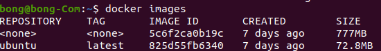

설치는 쉽다. 알아서 하고 초기 상태로 오자!

터미널에서 ```markdown docker pull ubuntu:20.04 ``` 과 같이 칠 경우

Docker 에서 다음과 같이 보여질 것이다.



다음과 같은 상태에서

```docker run  -v /tmp/.X11-unix:/tmp/.X11-unix -e DISPLAY=unix$DISPLAY --name Cap ubuntu```

X11서버를 사용하여 공유

```docker run  docker run -p 6080:80 --name Cap ubuntu```

-e 는 환경변수
-p 는 포트 지정으로 SSH 기능 사용
--name 사용자 네임으로 생성 (안하면 이름 이상해서 빡침)

https://lovemewithoutall.github.io/it/ubuntu-vnc-desktop/

참고하기
